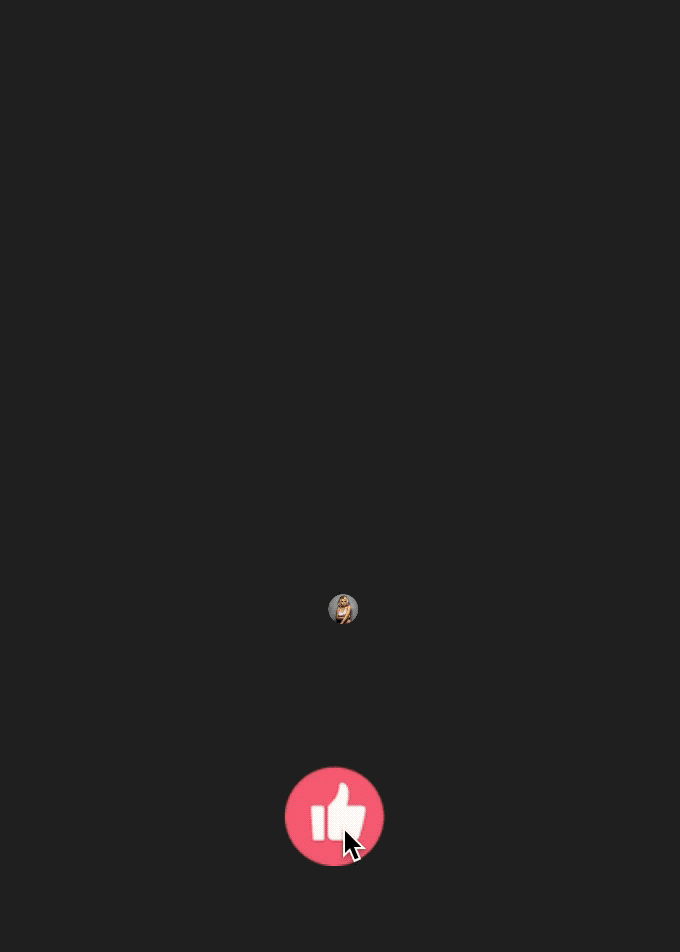

# JQEmitButton


> "今日头条" app 的直播间 点赞效果！




JQEmitButton is a subclass of UIButton and perform dazzle animation for touch event.It is easily to use and custom your style.

## Usage

Used in xib/storyboard file:

```
Change the "class name" to "JQEmitterButton"

```

Used in swift file:

```
let emitterBtn =  JQEmitterButton(frame: btnFrame)
emitterBtn.blingImage = aImage

```

Click JQEmitterButton to make dazzle bubbles or call the method below to make these automatically :

```
emitterBtn.emit(count: 100)

```


## Requirement
===========
* iOS 10.0+


## Release Notes
==============
* Ver 1.0
  - First Commit

